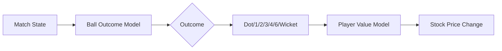

# Cricket ML Model - Implementation Plan

Build an excellent ML model for realistic cricket simulation using real IPL data (67,303 deliveries, 2020-2024).

---

## Model Architecture

We'll build **two interconnected models**:



### Model 1: Ball Outcome Predictor
**Purpose**: Predict probability distribution of next ball outcome
**Type**: Gradient Boosting Classifier (XGBoost/LightGBM)
**Output**: Probabilities for [DOT, SINGLE, DOUBLE, TRIPLE, FOUR, SIX, WICKET]

### Model 2: Player Value Model  
**Purpose**: Convert ball outcomes to realistic stock price movements
**Type**: Rule-based + learned weights from historical performance

---

## Features (15+ inputs)

| Feature | Type | Description |
|---------|------|-------------|
| `over` | int | Current over (0-19) |
| `ball_in_over` | int | Ball number in over (1-6) |
| `match_phase` | cat | POWERPLAY/MIDDLE/DEATH |
| `innings` | int | 1 or 2 |
| `runs_scored` | int | Runs scored so far |
| `wickets_lost` | int | Wickets lost |
| `run_rate` | float | Current run rate |
| `required_rate` | float | Required rate (innings 2) |
| `batsman_sr` | float | Batsman career strike rate |
| `batsman_avg` | float | Batsman career average |
| `bowler_economy` | float | Bowler career economy |
| `bowler_sr` | float | Bowler strike rate |
| `matchup_sr` | float | This batsman vs this bowler historical SR |
| `venue_avg_score` | float | Average score at venue |
| `recent_form` | float | Batsman runs in last 5 balls |

---

## Real Data Insights (From Analysis)

### Ball Outcome Distribution
| Outcome | Probability |
|---------|-------------|
| Single | 36.71% |
| Dot | 34.05% |
| Four | 11.77% |
| Six | 6.14% |
| Double | 5.98% |
| Wicket | 5.09% |

### Phase-wise Patterns
| Phase | Dots | Runs 1-3 | Boundaries | Wickets |
|-------|------|----------|------------|---------|
| Powerplay | 44.5% | 30.9% | 20.8% | 3.9% |
| Middle | 30.0% | 50.9% | 14.6% | 4.5% |
| Death | 28.3% | 43.3% | 20.6% | 7.9% |

---

## Proposed Changes

### Component 1: Data Pipeline

#### [NEW] [create_training_data.py](file:///Users/rakeshmohan/Desktop/game%20app/data/create_training_data.py)
- Load raw deliveries
- Engineer all 15+ features
- Create matchup statistics lookup tables
- Split train/validation/test (70/15/15)
- Export to `training_data.csv`

---

### Component 2: ML Models

#### [NEW] [train_ball_model.py](file:///Users/rakeshmohan/Desktop/game%20app/ml/train_ball_model.py)
- Train XGBoost/LightGBM classifier
- Hyperparameter tuning with cross-validation
- Evaluate with log-loss and accuracy
- Export model to `ball_outcome_model.json`

#### [NEW] [train_value_model.py](file:///Users/rakeshmohan/Desktop/game%20app/ml/train_value_model.py)
- Learn price movement patterns from outcomes
- Calibrate volatility by player type (batsman/bowler/allrounder)
- Export weights to `value_model.json`

---

### Component 3: JavaScript Integration

#### [NEW] [ml_predictor.js](file:///Users/rakeshmohan/Desktop/game%20app/ml_predictor.js)
- Load trained model weights
- Implement prediction function in pure JS
- Export `predictBallOutcome(features)` → probability array
- Export `calculatePriceChange(player, outcome)` → price delta

#### [MODIFY] [game.js](file:///Users/rakeshmohan/Desktop/game%20app/game.js)
- Replace random ball simulation with ML predictions
- Use model for realistic price movements
- Add player stats from CSV as base prices

---

### Component 4: Data Files

#### [NEW] [player_stats.json](file:///Users/rakeshmohan/Desktop/game%20app/data/player_stats.json)
- Pre-computed player statistics for quick lookup
- Career SR, average, economy for each player

#### [NEW] [matchup_table.json](file:///Users/rakeshmohan/Desktop/game%20app/data/matchup_table.json)
- Bowler-batsman historical matchup stats
- ~1000 most common matchups in IPL

---

## Verification Plan

### Model Training Verification
```bash
# Check model accuracy
python ml/train_ball_model.py --evaluate
# Expected: >60% accuracy, log-loss < 1.5
```

### Integration Testing
1. Open game in browser
2. Start match
3. Verify:
   - Outcomes follow realistic distribution (~35% dots, ~12% fours)
   - Powerplay has more boundaries than middle overs
   - Death overs have more wickets
   - Player prices move based on performance

### Comparison Test
- Run 100 simulated overs
- Compare outcome distribution to real IPL data
- Ensure within 5% of actual probabilities
